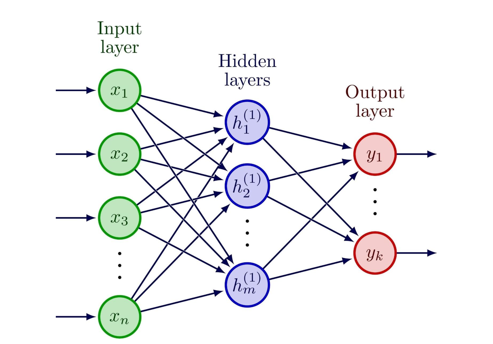
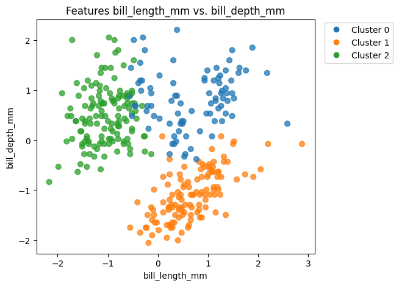
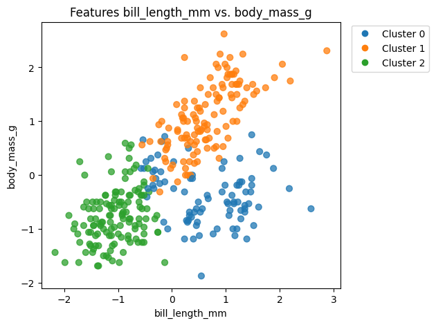
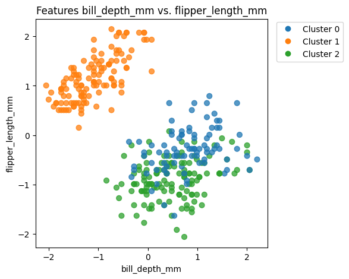
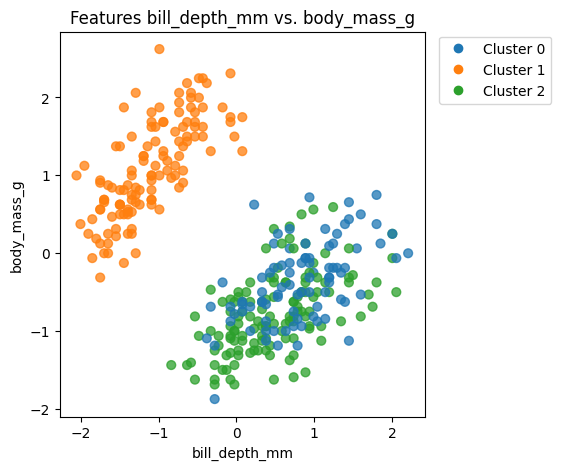

# Clustering Data and Visualizing in 2D

## I. Project Overview

In this project, from theoretical aspect, we will visit the following concepts:

- General Data Science pipeline
- Unsupervised learning
- Representation learning
- High-dimensional data characteristics
- Neural networks

We will overview the algorithms of:

- *K-means*
- *Self-Organizing Map (SOM)*

And we will use 2D visualizations to **explore**, **understand** and **explain** **patterns** in the data. We will get hands on experience how unsupervised and representation learning works along with how to visualize high-dimensional data in a way that is interpretable for the human eye. At the end, we will connect how SOM relates to a neural network. With all the steps documented, we will end up with a **concise** and **comprehensive report** that you can refer to in the future, along with the possibility to share our results via certain channels of the *Data Science Club*.

## II. Background

### General Data Science pipeline

#### 1. Define and understand the problem

The problem needs to be clearly defined and then turned into a Data Science task, so clear steps can be defined on how to solve it.

#### 2. Data collection

In this step, it is important to collect the data that is suitable for the job. It is a good idea to collect more data than you need as data sets can be incomplete and dirty. Although, it is very important to highlight that the *quality* of the data is more important than the *quantity*.

#### 3. Data cleaning and preprocessing

Raw data can include missing entries, duplicates, extreme outliers to name a few. Un- or improperly processed data will lead to bad models.

#### 4. Data exploration (EDA)

In this phase—often referred to as *Exploratory Data Analysis*—characteristics of the dataset are summarized and visualized. It helps in understanding what the collected data tells us: answer questions right away, see patterns or anomalies that could guide in building a better model.

#### 5. Model building

In this part, the preprocessed data is used to train a model that discoveres hidden patterns or learn from it in order to make predictions for the future.

#### 6. Evaluation

The trained model is evaluated on never before seen samples that we refer to as the test (or holdout) set, by whichwe can verify how well the model generalizes.

#### 7. Deployment and refinement

In this stage models get deployed, observed and refinements are initiated to start the cycle again.

### Supervision in Machine Learning

<!-- Models usually fall into two categories: *Supervised* and *Unsupervised*. Supervised models have a known outcome, it has labeled data. For example, a model trained on spam emails would include examples of both spam and non-spam emails, from which it „learns” what a spam email looks like. Unsupervised models, on the other hand, don’t have such labels, they compare patterns and trends in data. For example, if you wanted to know the shopping habits of your customers based on their preferences. Unsupervised learning can be challenging as its output can be vague and inconcrete which can lead to bias. It's evaluation is completely different than that of supervised approaches. Still unsupervised learning has the advantage to spot hiddenor previously not seen paterns, that supervised models cannot recognize unless specifically trained to do so. -->

#### Supervised

In supervised feature learning, the input data is labelled, meaning data given to the model includes input-label pairs. This resorts in a representation with high label prediction accuracy. Examples include supervised neural networks, multilayer perceptrons, and dictionary learning.

#### Unsupervised

Unsupervised feature learning uses unlabelled input data, it learns features by analyzing the relationship between data points. Examples include Clustering (K-means), ICA and matrix factorization.

#### Other methods

In semi-supervised learning, a model is trained on data related to one class, or some of the classes. Real life scenarios include anomaly detection where there is sufficient training data for normal events while anomalous ones occur rarely, expensive to acquire, or they evolve in a way that only deviations from the normal boundary can successfully detect them.

In self-supervised learning, features are learned using unlabelled data like unsupervised learning, however input-label pairs are constructed from each data point, enabling learning the structure of the data through supervised methods. Examples include word embeddings and autoencoders.

### Representation Learning

Representation/feature learning is a broader term for techniques that allow an ML system to automatically discover representations needed for further tasks such as feature detection and classification. These tasks require inputs that are mathematically easy to represent and convenient to process and do operations with, however real world data is often the opposite (images, videos, sensor data, etc...). These representations are usually continuous vectors.

#### Autoencoders

An autoencoder is a type of neural network architecture that is having three core components: the encoder, the decoder, and the latent-space representation. The encoder compresses the input to a lower latent-space representation via weight matrixes biases and a nonlinear activation function and then the decoder reconstructs it.

#### Prototype Learning
Prototype learning is a family of methods where a model represents each class, cluster, or concept using prototypes—vectors in a learned feature space that act as representative examples. A model then makes predictions by comparing new samples to these prototypes. These prototypes provide an abstract representation for many natural categories and concepts.

## III. K-means Clustering

Clustering is an unsupervised machine learning technique that learns patterns from the features of a dataset without using labels. *K-means* is a simple algorithm that attempts to partition samples into $K$ groups with roughly equal variance, although the latter is not guaranteed.

### Overview

K-means clustering is prototype learning algorithm used to categorize n (usually vectors of unlabelled data) items into k number of clusters. It is useful for identifying natural groupings of data and structuring raw data. Determining what k should be is important for the segmentation to be meaningful and there are multiple methods for determining the optimal value for k. K-means has a variety of uses due to its simplicity and effectiveness, including data segmentation, image compression and anomaly detection.

* Unsupervised machine learning technique
* "K-means" = "K averages" / "K central tendencies" / "K centroids"
* Can be looked at as a prototyping tool that discretizes the data into $K$ prototypes

### Algorithm in a nutshell

The algorithm will categorize the inputs into k clusters based on similarity. Measuring of similarity is done with the square of the Euclidean distance of the data vectors. Summarized, the algorithm works as follows:

1. Initialization: Randomly select k number of centerpoints for the clusters, called centroids.
2. Assignment: Each data point is assigned to a cluster based on which centroid is the nearest to it (using Euclidean distance).
3. Update: We recalculate the position of each centroid based on the average of the data points in each cluster.
4. Repeat: We repeat this process until the position of each centroid is unchanged or we reach a pre-defined iteration limit

### Algorithm in details

According to the *Scikit Learn Documentation*, the K-means algorithm "divides a set of $N$ samples $X$ into $K$ disjoint clusters $C$, each described by the mean $\mu_j$ of the samples in the cluster". These means are referred to as *centroids*, and despite living in the same space, they are usually not part of the dataset. The number $K$ is required to be initialized, along with the starting positions of the centroids. The algorithm has an objective function that minimizes the criterion of *within-cluster sum-of-squares*, the so-called *inertia*.

$$
\sum^n_{i=0} \min_{\mu_j \in C} (|| x_i - \mu_j ||^2)
$$

Inertia is "a measure of how internally coherent clusters are". It assumes that clusters are convex and isotropic. As the documentation highlights it, it suffers from drawbacks:

- performs poorly on elongated clusters or manifolds with irregular shapes
- not normalized: lower values are better, zero is optimal, yet in higher-dimensions distances get inflated

The algorithm follows an iterative process that consists of three main steps.

- initialize centroid positions
- assign each sample to its nearest centroid
- create new centroids by taking the mean value of the samples assigned to each previous centroid,

then the difference between old and new centroids are calculated and the algorithm loops between steps 2) and 3) until this difference becomes small considering a threshold.

The documentation highlights yet another weakness of the algorithm at the stage of centroid initialization, as written, "K-means will always converge, however this may be to a local minimum". This outcome depends on the initial positions of the centroids, which if assigned randomly, may not find every cluster in the dataset. To address this, the algorithm in the *sklearn* library can be instructed to use a more intelligent initialization technique that places centroids distant from each other and can be used via the $init="\text{k-means++}"$ argument value. Besides the $n\_init$ parameter can be used to enhance this process, which is the "number of times the k-means algorithm is run with different centroid seeds" where the candidate with the best inertia is kept.

## IV. Neural Networks

In order to comprehend the function of deep learning in unsupervised tasks, it is necessary to first define a neural network in its broadest definition. Neural networks, which are built to imitate biological processes, are fundamentally the engines for modern artificial intelligence. A neural network is described by *Amazon Web Services (AWS)* as a "method in artificial intelligence that teaches computers to process data in a way that is inspired by the human brain."

### Layered structure

According to *GeeksforGeeks*, Artificial Neural Network (ANN) layers can be explained as follows:

1. **Input Layer:** This is the network's entry point. It transfers raw data—such as an image's pixels or a dataset's columns—to the layers that follow. Key role: this layer merely buffers and sends the input signals to the buried levels; no calculation takes place here.
2. **Hidden Layers:** The real "learning" and processing takes place in these layers, which are situated between the input and output layers. A network is referred to as "Deep Learning" if it has one or more hidden layers. Key role: they use mathematical processes (weighted sums) and activation functions (like *sigma* or *ReLU*) to add non-linearity to extract features and patterns from the data.

The Hidden Layer types can vary depending on the architecture:
* Dense (Fully Connected) Layers : Every neuron connects to every neuron in the next layer
* Convolutional (Convergent) Layers: Mostly used to identify geometric sequence in images
* Recurrent (Repetitive) Layers: Applied to sequence data, such as text or periods of time
* Pooling & Dropout Layers: used to avoid overfitting and minimize dimensions, respectively

*AWS* states that "individual nodes can be simple, but when connected in a dense network,
they solve complex problems." Supervised learning, in which the network is trained on labeled data (e.g., displaying computer images labeled "cat" until it learns to identify a cat), is traditionally the most well-known use of this design. The data isn't always labeled, though. This leads us to unsupervised techniques such as clustering.

### Neural Networks in Clustering

Clustering is a key method in unsupervised learning, claims *IBM*. It involves "identifying distinct groups of data points" in which the machine must independently recognize patterns without the need for human assistance or pre-existing classifications. According to *IBM*, "clustering algorithms identify distinct groups of data points... such that data points in the same group are more similar to other data points in the same group than those in other groups."

A shift in architecture is necessary to combine these two concepts—by utilizing a Neural Network, which is typically supervised, with Clustering, that is unsupervised. How does the network learn if there are no labels to fix it? Standard feed-forward networks aren't ideally suited for this, as discussed in the *Cross Validated (Stack Exchange)* forum. Rather, certain designs are needed. The usage of automatic encoders is one popular strategy that was brought up in the conversation. One contributor points out that clustering can be accomplished by "training an autoencoder... and then clustering the data in the bottom layer." In this case, the clustering process is far more effective than attempting to group raw, high-dimensional data since the neural network learns to compress data (dimensionality reduction) into a dense representation.

However, there is a more direct "neural" approach to clustering that relies on competitive
learning instead of error correction which is *Self-Organizing Map (SOM)*.

## V. Self-Organizing Maps (SOM)

<!-- TODO -->

## VI. Experiments

### Dataset

The `Palmer penguins` dataset was used during the experiments obtained from the `palmerpenguins` python library. The original shape of the dataset is 344 observations and 8 features, both categorical and numerical.

### Preprocessing

The dataset was limited to the 4 numerical features of `bill_length_mm`, `bill_depth_mm`, `flipper_length_mm` and `body_mass_g`. Observations with missing values in these features were dropped, resulting in a total of 342 records. The features of this dataset were standardized.

### Clustering

A `KMeans` estimator from the `sklearn` library was used to fit and cluster the data in its preprocessed four-dimensional space with a heuristic to separate 3 groups.

To interpret the results, the data labeled by cluster ids was plotted in two-dimensional scatter plots, for all features, pairwise. Despite only a few dimensions, this resulted in 6 individual plots. Examples are included below.

One important insight is that clusters do not separate clearly and there are regions where they overlap each other in the resulting plots, that may generate confusion in the observer. To resolve this, we list the reasons for this phenomenon:

- Dataset itself **may not have clear separation** lines for the real groups: Clusters meet which can be amplified by the styling properties of the scatter plot such as the size of the marker
- **Projection** from 4D to 2D **distorts** the **original structure**: In the original feature space those marked clusters may not overlap as they appear in the 2D collapsed view
- **K-Means assumptions**: K-Means divides the data space into convex spherical clusters, that may lead to arbitrary separation lines that do not align with irregularly shaped clusters

